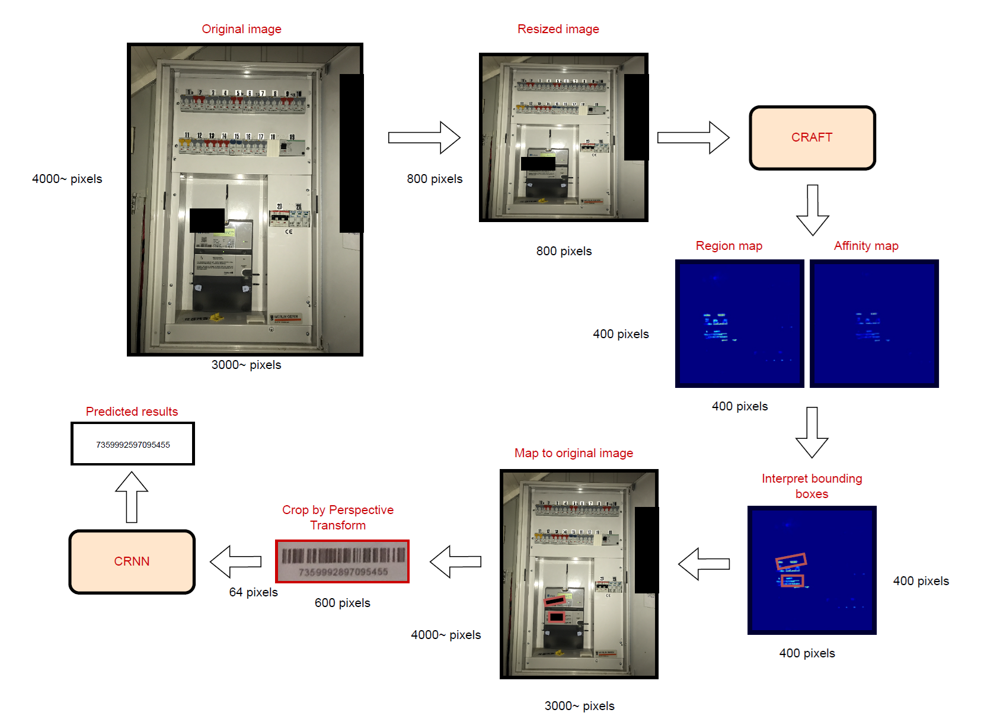
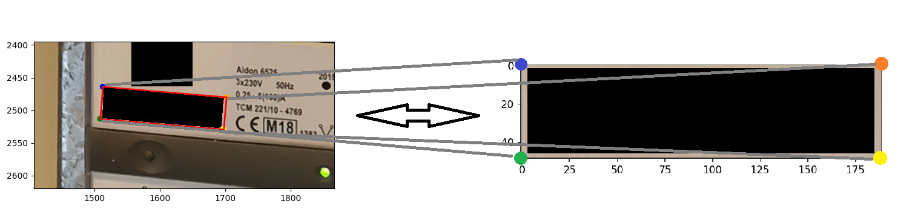
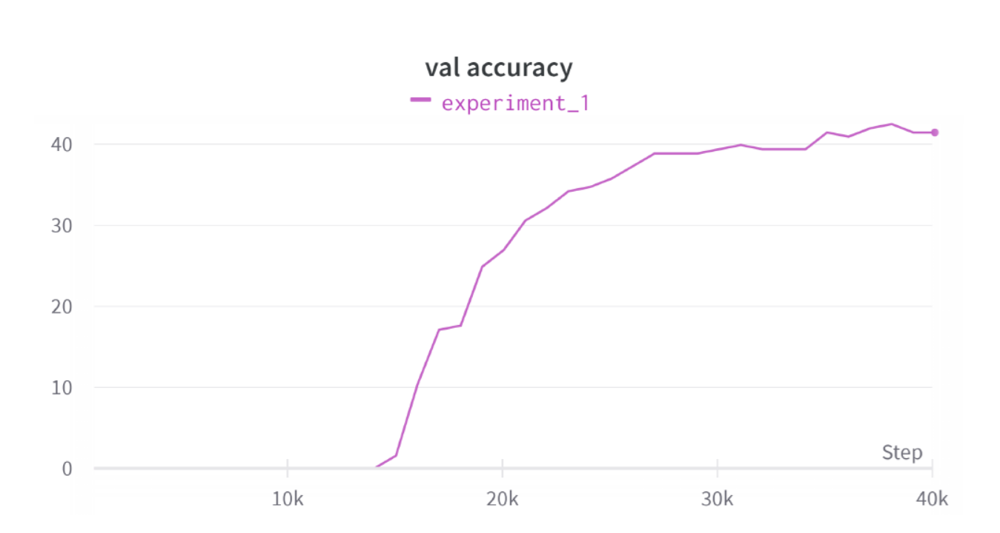

# Image Data Extraction Pipeline for Hardware Identification

Computer vision / OCR project focused on extracting serial numbers from product images and turning unstructured image input into structured data.

This repository is a **portfolio version** of a DTU project developed with an industry use case in mind. The original project explored automated hardware identification and quality assurance using a combination of:

- barcode detection
- scene text detection
- OCR
- image preprocessing and cropping
- retraining of text-recognition models

---

## Pipeline Overview

The pipeline combines scene text detection (CRAFT), perspective correction, and OCR-based recognition (CRNN / EasyOCR-style models) to extract serial numbers from hardware inspection images captured in real-world environments.

---

## Project Goal

The objective was to reduce manual quality-assurance work by automating the extraction of hardware serial numbers from images captured in real-world conditions.

Typical challenges included:

- inconsistent lighting
- camera angle/perspective distortion
- motion blur and low image quality
- noisy backgrounds
- variable text and barcode visibility

---

## Example Input Image

Example image from a hardware inspection process. The goal is to automatically extract the serial number from the device inside the cabinet.

---

## Serial Number Detection

Detected text region after applying bounding-box detection and perspective transformation before OCR recognition.

The pipeline detects potential serial-number regions and corrects perspective distortion before passing the cropped image to the recognition model.

---

## Recognition Model

The recognition stage was implemented using a **CRNN-style architecture trained with CTC loss**.

The project explored transfer-learning approaches using pretrained feature extractors such as:

- VGG
- ResNet

Part of my contribution involved helping adapt and debug the transfer-learning pipeline so that these backbone architectures could be integrated into the training workflow.

---

## Training Results

Validation accuracy during training of the recognition network.

Results were mixed, which is realistic when applying OCR pipelines to noisy real-world industrial images.

---

## Data Privacy

Original product images cannot be shared publicly due to confidentiality restrictions.

The examples shown here are **anonymized or synthetic images** used only to demonstrate the pipeline.

---

## Why this repo is a portfolio version

The original project used company-related images and annotations that are **not included here**.

To respect confidentiality and privacy, this public version only contains:

- selected code
- notebooks for exploration
- training/preprocessing scripts
- project structure and documentation

The following are intentionally excluded from the public repo:

- raw customer or company images
- labeled image datasets
- serial numbers or other sensitive identifiers
- internal result dumps and large intermediate artifacts

---

## Repository structure

    src/
        preprocessing/
            process_bounding_boxes.py
        training/
            data_load_both_batches.py
            to_training_model.py
        detection/
            craft/
                main.py
                craft.py

    notebooks/
        BarcodeScanner_OpenCV.ipynb
        Data_exploration.ipynb
        Exploration_test_results.ipynb
        Initial_accuracy.ipynb
        Initial_accuracy_clean_data.ipynb

---

## Key components

- Bounding-box processing for converting annotations into usable crops
- Perspective correction for rotated or distorted regions
- CRAFT-based scene text detection
- EasyOCR-style retraining workflow for recognition
- Exploratory notebooks for evaluating barcode and OCR performance

---

## Results and limitations

The project was valuable primarily as an exploration of a difficult real-world OCR / computer vision problem.

Results were mixed, which is realistic for industrial image pipelines with noisy input data. The strongest value of the project is therefore not a single benchmark number, but the end-to-end workflow:

- data cleaning
- bounding-box transformation
- image preprocessing
- model experimentation
- evaluation of practical feasibility

---

## My contribution

My contribution focused on the applied project workflow, including:

- analysis of model performance
- evaluation of detection and OCR approaches
- debugging and integration of transfer-learning pipelines
- project documentation and reporting

---

## Notes for running the code

Some scripts still contain **local file paths** from the original development environment and will need path cleanup before reuse.

This repository is therefore best viewed as:

- a portfolio/documentation repo
- a record of the project structure and methods
- a base for building a cleaner, reusable version later

---

## Suggested next step

For a fully reusable public version, the codebase could be refactored into a smaller demo pipeline with:

- synthetic sample images
- environment-independent paths
- a minimal reproducible notebook
- a lightweight evaluation example
